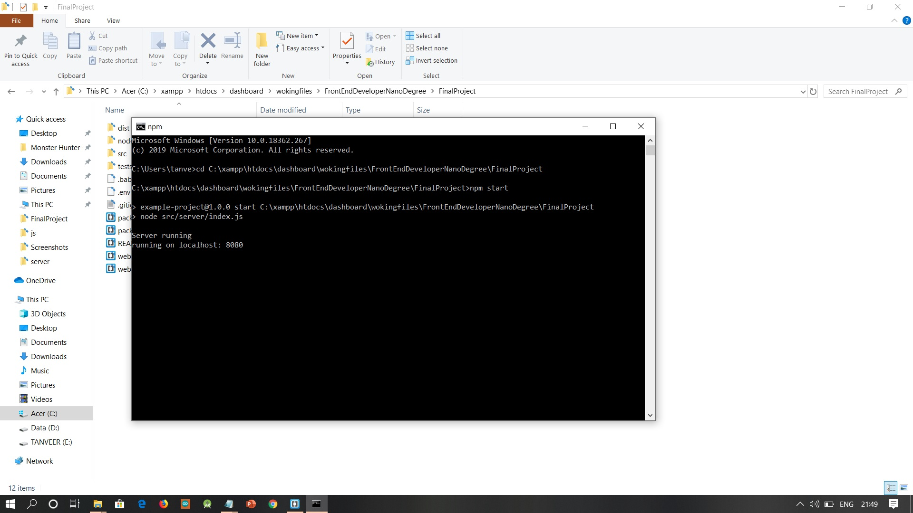
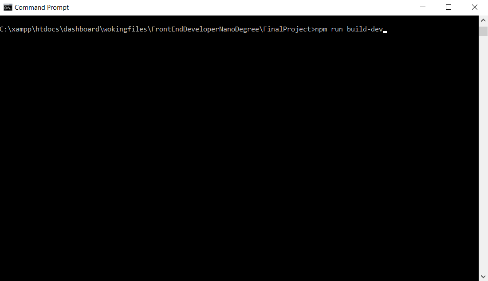
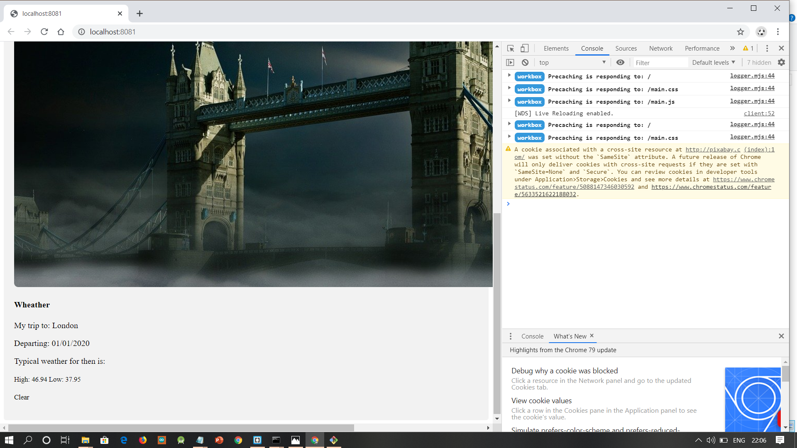
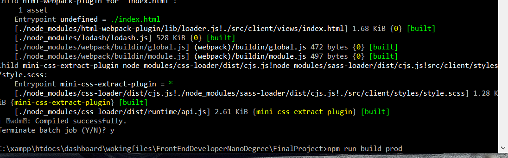
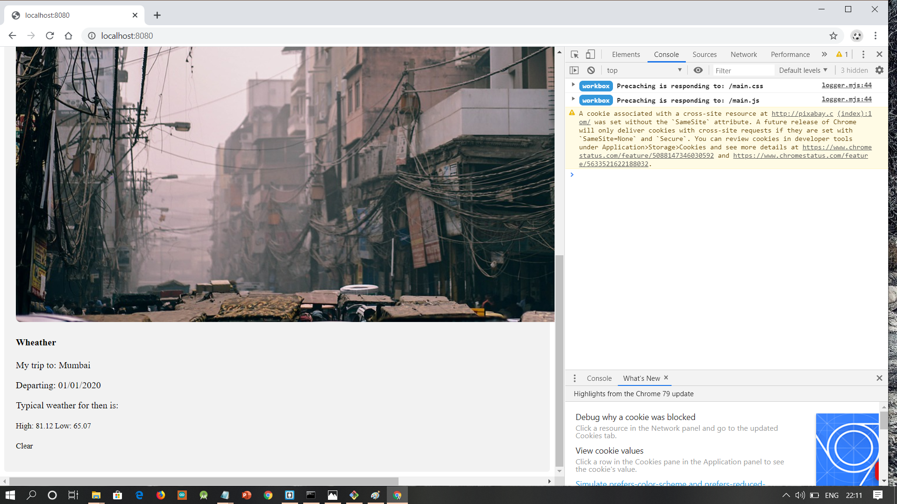

# Webpack Express App Project

Tanveer - Udacity Front End Dev final project

This is a project that excercised my ability to navigate through the module bundler, 'Webpack'. The result of which is a weather app and express/ node.js driven application. This excercise application utilises 3 API's, dependant upon one another.

## What this project encompassses:

- Webpack entry point
- Webpack output and dist folder
- Webpack Loaders
- Webpack Plugins
- Webpack Mode

## How to install npm

1. Open Command Prompt 
2. Change your directory to your current directory by typing "cd currentDirName"
3. Install npm : npm install

## To run in Development Mode, follow the steps as below

1. Open Command prompt and run server by typing "npm start"

2. Open one more command prompt and type "npm run build-dev"

3. Automatically Web Browzer will be opened.

## To run in Production Mode, follow the steps as below,
1. Open Command Prompt and type "npm run build-prod"

2. Start the server by entering "npm start"

3. Open Browzer and type "http://localhost:8080"

